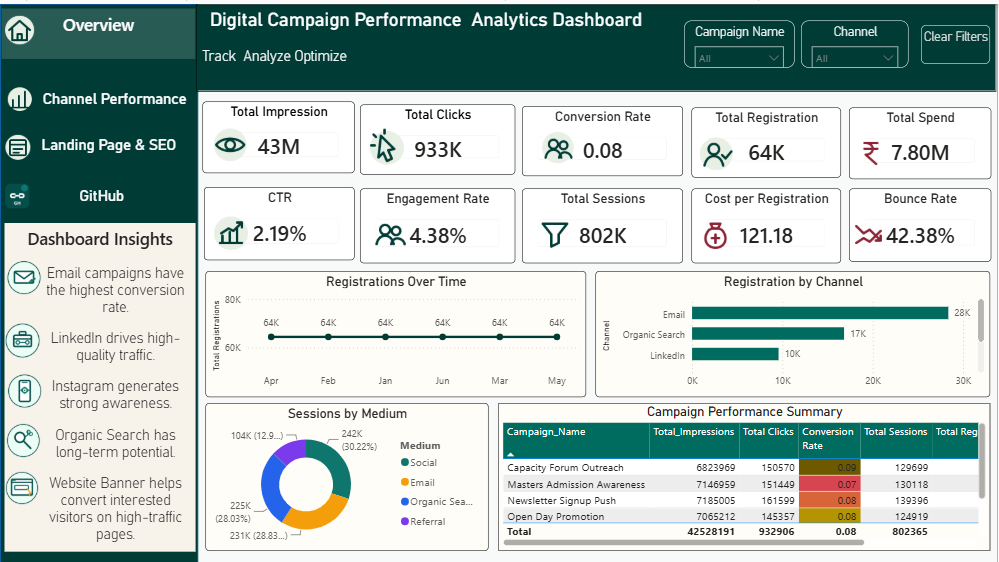
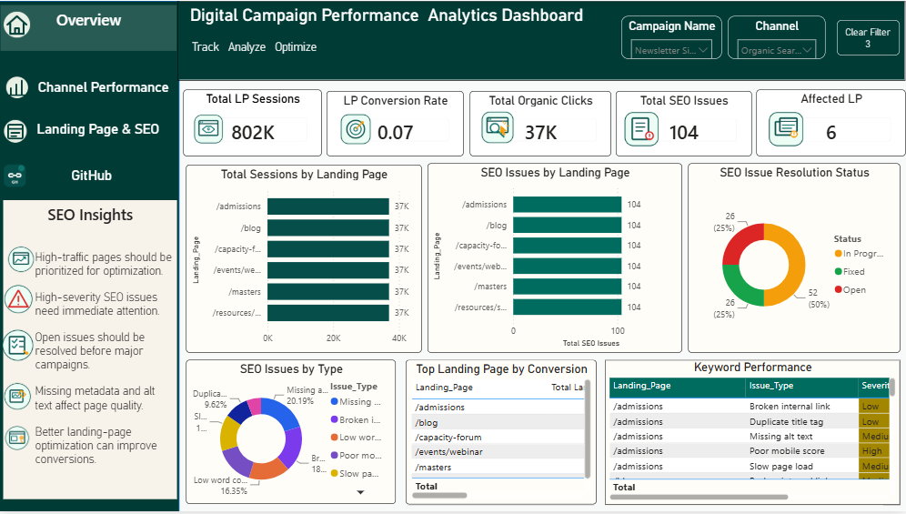
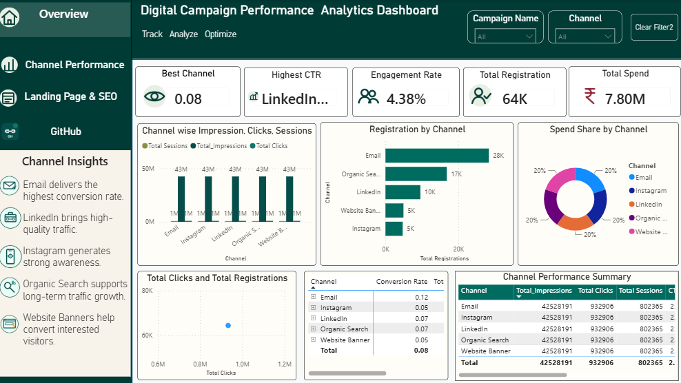

# Digital-Marketing-Campaign-Analytics-Dashboard

A Power BI portfolio project combining digital marketing analytics, channel performance, landing-page analysis and SEO auditing.

## Project Overview

This dashboard analyses digital campaign performance across LinkedIn, Instagram, Email, Organic Search and Website Banner.

It helps communications and marketing teams monitor campaign reach, website traffic, engagement, registrations, conversion performance, landing-page effectiveness and SEO issues.

> This project uses mock data created for learning and portfolio demonstration.

---

## Dashboard Preview

### 1. Executive Overview

The Executive Overview presents a summary of campaign performance, including impressions, clicks, sessions, registrations, engagement and conversion metrics.

<p align="center">
  
</p>

### 2. Channel Performance

The Channel Performance page compares LinkedIn, Instagram, Email, Organic Search and Website Banner across reach, traffic, engagement, registrations and cost efficiency.

<p align="center">
  
</p>

### 3. Landing Page and SEO Audit

The Landing Page and SEO Audit page analyses landing-page traffic, conversion performance, SEO issue types, severity and resolution status.

<p align="center">
  
</p>

---

## Tools Used

* Power BI
* Power Query
* Microsoft Excel
* Data Modelling
* Data Visualisation
* Digital Marketing Analytics
* SEO Audit Analysis

---

## Key Metrics

* Total Impressions
* Total Clicks
* Total Sessions
* Total Registrations
* Click-Through Rate
* Engagement Rate
* Conversion Rate
* Cost per Registration
* Landing-Page Conversion Rate
* Total SEO Issues
* Open SEO Issues
* High-Severity Issues

---

## Key Insights

### Channel Performance

* Email delivers the highest conversion rate.
* LinkedIn brings high-quality traffic.
* Instagram generates strong awareness.
* Organic Search supports long-term traffic growth.
* Website Banners help convert interested visitors.

### Landing Page and SEO

* High-traffic pages should be prioritised for optimisation.
* High-severity SEO issues require immediate attention.
* Open issues should be resolved before major campaigns.
* Missing metadata and alt text affect page quality.
* Better landing-page optimisation can improve conversions.

---

## Recommendations

* Use Email and LinkedIn for conversion-focused campaigns.
* Use Instagram for awareness and audience reach.
* Track campaign links using UTM parameters.
* Improve landing-page call-to-action placement.
* Prioritise high-traffic pages for optimisation.
* Resolve high-severity SEO issues before major campaigns.
* Review campaign performance regularly using Power BI.

---

## Interactive Features

* Channel and Campaign slicers
* Synced filters across dashboard pages
* Clear Filters button
* Left-side page navigation
* Conditional formatting
* Interactive charts and KPI cards
* Cross-filtering between visuals

---

## Repository Structure

```text
Digital-Marketing-Campaign-Analytics-Dashboard/
│
├── Dashboard/
│   └── Digital_Marketing_Campaign_Analytics_Dashboard.pbix
│
├── Dataset/
│   └── Digital_Marketing_PowerBI_Project_Dataset.xlsx
│
├── Screenshots/
│   ├── page_1_executive_overview.png
│   ├── page_2_channel_performance.png
│   └── page_3_landing_page_seo.png
│
└── README.md
```

---

## How to Use

1. Download or clone the repository.
2. Open the Power BI file from the `Dashboard` folder.
3. Reconnect the Excel dataset if Power BI requests the source location.
4. Use the Channel and Campaign slicers to explore the dashboard.
5. Use the Clear Filters button to reset selections.

---

## Data Disclaimer

The dataset used in this project is mock data created for learning and portfolio demonstration. It does not represent the actual campaign performance of  any other organisation.

---

## Author

**Hiba Fathima Y**
Aspiring Data Analyst

* [LinkedIn](https://www.linkedin.com/in/hibafathimay)
* [GitHub](https://github.com/hibaafathima172-art)

